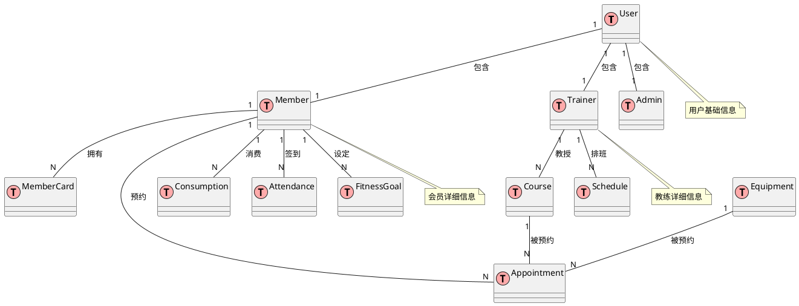

# 健身房管理系统数据库设计文档

## 1. 概述

### 1.1 文档目的
本文档详细描述了健身房管理系统的数据库设计，包括数据表结构、字段定义、索引设计、表间关系等内容，为系统开发和数据库实施提供详细指导。

### 1.2 术语定义
| 术语     | 解释说明                 |
| :------- | :---------------------- |
| 会员     | 在健身房注册的客户用户   |
| 教练     | 健身房的专业指导人员     |
| 管理员   | 系统的管理人员           |
| 会员卡   | 会员的身份凭证和计费依据 |
| 课程     | 由教练提供的健身指导活动 |
| 预约     | 会员对课程或设备的预订   |
| 消费记录 | 会员在健身房的消费明细   |

## 2. 数据库设计原则

- **规范化设计**：遵循第三范式(3NF)，减少数据冗余，确保数据一致性
- **可扩展性**：考虑未来业务扩展需求，设计灵活的数据结构
- **性能优先**：合理设计索引，优化查询性能
- **安全性**：敏感数据加密存储，权限严格控制
- **完整性**：通过外键约束、非空约束等保证数据完整性

## 3. 数据库实体关系图(ERD)



## 4. 数据表结构设计

### 4.1 用户表 (user)

| 字段名     | 数据类型       | 约束         | 描述             |
| :--------- | :------------- | :----------- | :--------------- |
| id         | BIGINT         | PRIMARY KEY  | 用户ID           |
| username   | VARCHAR(50)    | NOT NULL UNIQUE | 用户名         |
| password   | VARCHAR(255)   | NOT NULL     | 密码(加密存储)   |
| role       | VARCHAR(20)    | NOT NULL     | 角色(member/trainer/admin) |
| phone      | VARCHAR(20)    | NOT NULL     | 手机号           |
| email      | VARCHAR(100)   | NULL         | 邮箱             |
| status     | TINYINT        | DEFAULT 1    | 状态(0:禁用,1:启用) |
| create_time| DATETIME       | NOT NULL     | 创建时间         |
| update_time| DATETIME       | NOT NULL     | 更新时间         |

### 4.2 会员表 (member)

| 字段名     | 数据类型       | 约束         | 描述             |
| :--------- | :------------- | :----------- | :--------------- |
| id         | BIGINT         | PRIMARY KEY  | 会员ID           |
| user_id    | BIGINT         | NOT NULL UNIQUE, FOREIGN KEY REFERENCES user(id) | 用户ID |
| name       | VARCHAR(50)    | NOT NULL     | 真实姓名         |
| gender     | TINYINT        | NULL         | 性别(0:女,1:男)  |
| birth_date | DATE           | NULL         | 出生日期         |
| address    | VARCHAR(255)   | NULL         | 地址             |
| height     | DECIMAL(5,2)   | NULL         | 身高(cm)         |
| weight     | DECIMAL(5,2)   | NULL         | 体重(kg)         |
| join_date  | DATE           | NOT NULL     | 入会日期         |
| last_login | DATETIME       | NULL         | 最后登录时间     |
| create_time| DATETIME       | NOT NULL     | 创建时间         |
| update_time| DATETIME       | NOT NULL     | 更新时间         |

### 4.3 教练表 (trainer)

| 字段名     | 数据类型       | 约束         | 描述             |
| :--------- | :------------- | :----------- | :--------------- |
| id         | BIGINT         | PRIMARY KEY  | 教练ID           |
| user_id    | BIGINT         | NOT NULL UNIQUE, FOREIGN KEY REFERENCES user(id) | 用户ID |
| name       | VARCHAR(50)    | NOT NULL     | 真实姓名         |
| gender     | TINYINT        | NULL         | 性别(0:女,1:男)  |
| specialty  | VARCHAR(100)   | NOT NULL     | 专长领域         |
| experience | INT            | DEFAULT 0    | 工作年限         |
| certificate| VARCHAR(255)   | NULL         | 证书信息         |
| rating     | DECIMAL(3,1)   | DEFAULT 0.0  | 评分(0-5分)      |
| create_time| DATETIME       | NOT NULL     | 创建时间         |
| update_time| DATETIME       | NOT NULL     | 更新时间         |

### 4.4 管理员表 (admin)

| 字段名     | 数据类型       | 约束         | 描述             |
| :--------- | :------------- | :----------- | :--------------- |
| id         | BIGINT         | PRIMARY KEY  | 管理员ID         |
| user_id    | BIGINT         | NOT NULL UNIQUE, FOREIGN KEY REFERENCES user(id) | 用户ID |
| name       | VARCHAR(50)    | NOT NULL     | 真实姓名         |
| position   | VARCHAR(50)    | NULL         | 职位             |
| department | VARCHAR(50)    | NULL         | 部门             |
| create_time| DATETIME       | NOT NULL     | 创建时间         |
| update_time| DATETIME       | NOT NULL     | 更新时间         |

### 4.5 会员卡表 (member_card)

| 字段名     | 数据类型       | 约束         | 描述             |
| :--------- | :------------- | :----------- | :--------------- |
| id         | BIGINT         | PRIMARY KEY  | 会员卡ID         |
| member_id  | BIGINT         | NOT NULL, FOREIGN KEY REFERENCES member(id) | 会员ID |
| card_number| VARCHAR(50)    | NOT NULL UNIQUE | 卡号           |
| card_type  | VARCHAR(50)    | NOT NULL     | 卡类型(月卡/年卡/次卡) |
| amount     | DECIMAL(10,2)  | NOT NULL     | 金额             |
| balance    | DECIMAL(10,2)  | NOT NULL DEFAULT 0 | 余额       |
| remaining_times | INT     | DEFAULT 0    | 剩余次数(次卡)   |
| start_date | DATE           | NOT NULL     | 开始日期         |
| end_date   | DATE           | NOT NULL     | 结束日期         |
| status     | TINYINT        | DEFAULT 1    | 状态(0:已过期,1:有效) |
| create_time| DATETIME       | NOT NULL     | 创建时间         |
| update_time| DATETIME       | NOT NULL     | 更新时间         |

### 4.6 课程表 (course)

| 字段名     | 数据类型       | 约束         | 描述             |
| :--------- | :------------- | :----------- | :--------------- |
| id         | BIGINT         | PRIMARY KEY  | 课程ID           |
| trainer_id | BIGINT         | NOT NULL, FOREIGN KEY REFERENCES trainer(id) | 教练ID |
| name       | VARCHAR(100)   | NOT NULL     | 课程名称         |
| description| TEXT           | NULL         | 课程描述         |
| course_type| VARCHAR(50)    | NOT NULL     | 课程类型         |
| duration   | INT            | NOT NULL     | 课程时长(分钟)   |
| capacity   | INT            | NOT NULL     | 最大人数         |
| price      | DECIMAL(10,2)  | NOT NULL     | 课程价格         |
| status     | TINYINT        | DEFAULT 1    | 状态(0:停用,1:启用) |
| create_time| DATETIME       | NOT NULL     | 创建时间         |
| update_time| DATETIME       | NOT NULL     | 更新时间         |

### 4.7 预约表 (appointment)

| 字段名     | 数据类型       | 约束         | 描述             |
| :--------- | :------------- | :----------- | :--------------- |
| id         | BIGINT         | PRIMARY KEY  | 预约ID           |
| member_id  | BIGINT         | NOT NULL, FOREIGN KEY REFERENCES member(id) | 会员ID |
| course_id  | BIGINT         | NULL, FOREIGN KEY REFERENCES course(id) | 课程ID |
| equipment_id | BIGINT        | NULL, FOREIGN KEY REFERENCES equipment(id) | 设备ID |
| appointment_time | DATETIME   | NOT NULL     | 预约时间         |
| actual_time| DATETIME       | NULL         | 实际使用时间     |
| duration   | INT            | NOT NULL     | 预约时长(分钟)   |
| status     | TINYINT        | DEFAULT 0    | 状态(0:待使用,1:已使用,2:已取消) |
| create_time| DATETIME       | NOT NULL     | 创建时间         |
| update_time| DATETIME       | NOT NULL     | 更新时间         |

### 4.8 设备表 (equipment)

| 字段名     | 数据类型       | 约束         | 描述             |
| :--------- | :------------- | :----------- | :--------------- |
| id         | BIGINT         | PRIMARY KEY  | 设备ID           |
| name       | VARCHAR(100)   | NOT NULL     | 设备名称         |
| type       | VARCHAR(50)    | NOT NULL     | 设备类型         |
| location   | VARCHAR(100)   | NOT NULL     | 设备位置         |
| status     | TINYINT        | DEFAULT 1    | 状态(0:故障,1:正常,2:维护中) |
| last_maintain | DATE         | NULL         | 最后维护日期     |
| next_maintain | DATE         | NULL         | 下次维护日期     |
| create_time| DATETIME       | NOT NULL     | 创建时间         |
| update_time| DATETIME       | NOT NULL     | 更新时间         |

### 4.9 消费记录表 (consumption)

| 字段名     | 数据类型       | 约束         | 描述             |
| :--------- | :------------- | :----------- | :--------------- |
| id         | BIGINT         | PRIMARY KEY  | 消费记录ID       |
| member_id  | BIGINT         | NOT NULL, FOREIGN KEY REFERENCES member(id) | 会员ID |
| member_card_id | BIGINT       | NULL, FOREIGN KEY REFERENCES member_card(id) | 会员卡ID |
| amount     | DECIMAL(10,2)  | NOT NULL     | 消费金额         |
| type       | VARCHAR(50)    | NOT NULL     | 消费类型(办卡/续卡/课程/商品) |
| payment_method | VARCHAR(20)  | NOT NULL     | 支付方式         |
| status     | TINYINT        | DEFAULT 0    | 状态(0:待支付,1:已支付) |
| description| VARCHAR(255)   | NULL         | 备注             |
| create_time| DATETIME       | NOT NULL     | 创建时间         |
| update_time| DATETIME       | NOT NULL     | 更新时间         |

### 4.10 签到表 (attendance)

| 字段名     | 数据类型       | 约束         | 描述             |
| :--------- | :------------- | :----------- | :--------------- |
| id         | BIGINT         | PRIMARY KEY  | 签到ID           |
| member_id  | BIGINT         | NOT NULL, FOREIGN KEY REFERENCES member(id) | 会员ID |
| check_in_time | DATETIME     | NOT NULL     | 签到时间         |
| check_out_time | DATETIME    | NULL         | 签出时间         |
| duration   | INT            | NULL         | 停留时长(分钟)   |
| device_info | VARCHAR(255)  | NULL         | 签到设备信息     |
| create_time| DATETIME       | NOT NULL     | 创建时间         |

### 4.11 健身目标表 (fitness_goal)

| 字段名     | 数据类型       | 约束         | 描述             |
| :--------- | :------------- | :----------- | :--------------- |
| id         | BIGINT         | PRIMARY KEY  | 目标ID           |
| member_id  | BIGINT         | NOT NULL, FOREIGN KEY REFERENCES member(id) | 会员ID |
| goal_type  | VARCHAR(50)    | NOT NULL     | 目标类型(减肥/增肌/塑形) |
| target_value | DECIMAL(10,2) | NOT NULL     | 目标值           |
| current_value | DECIMAL(10,2) | DEFAULT 0    | 当前值           |
| start_date | DATE           | NOT NULL     | 开始日期         |
| end_date   | DATE           | NOT NULL     | 计划完成日期     |
| status     | TINYINT        | DEFAULT 0    | 状态(0:进行中,1:已完成,2:已放弃) |
| create_time| DATETIME       | NOT NULL     | 创建时间         |
| update_time| DATETIME       | NOT NULL     | 更新时间         |

### 4.12 排班表 (schedule)

| 字段名     | 数据类型       | 约束         | 描述             |
| :--------- | :------------- | :----------- | :--------------- |
| id         | BIGINT         | PRIMARY KEY  | 排班ID           |
| trainer_id | BIGINT         | NOT NULL, FOREIGN KEY REFERENCES trainer(id) | 教练ID |
| course_id  | BIGINT         | NULL, FOREIGN KEY REFERENCES course(id) | 课程ID |
| schedule_date | DATE         | NOT NULL     | 排班日期         |
| start_time | TIME           | NOT NULL     | 开始时间         |
| end_time   | TIME           | NOT NULL     | 结束时间         |
| type       | VARCHAR(20)    | NOT NULL     | 类型(课程/值班/休息) |
| location   | VARCHAR(100)   | NULL         | 地点             |
| status     | TINYINT        | DEFAULT 1    | 状态(0:已取消,1:正常) |
| create_time| DATETIME       | NOT NULL     | 创建时间         |
| update_time| DATETIME       | NOT NULL     | 更新时间         |

## 5. 索引设计

### 5.1 主键索引
- 所有表的id字段均为主键，自动创建主键索引

### 5.2 唯一索引
- user表：username字段 (唯一约束)
- member表：user_id字段 (唯一约束)
- trainer表：user_id字段 (唯一约束)
- admin表：user_id字段 (唯一约束)
- member_card表：card_number字段 (唯一约束)

### 5.3 普通索引
- user表：phone字段 (提高登录查询效率)
- member表：join_date字段 (按入会日期查询)
- trainer表：specialty字段 (按专长查询)
- course表：trainer_id、course_type字段 (提高查询效率)
- appointment表：member_id、course_id、appointment_time字段 (预约查询)
- consumption表：member_id、create_time字段 (消费记录查询)
- attendance表：member_id、check_in_time字段 (签到记录查询)
- schedule表：trainer_id、schedule_date字段 (排班查询)

## 6. 数据库初始化脚本

### 6.1 创建数据库

```sql
CREATE DATABASE IF NOT EXISTS gym_management DEFAULT CHARACTER SET utf8mb4 COLLATE utf8mb4_unicode_ci;
USE gym_management;
```

### 6.2 创建用户表

```sql
CREATE TABLE IF NOT EXISTS user (
  id BIGINT AUTO_INCREMENT PRIMARY KEY,
  username VARCHAR(50) NOT NULL UNIQUE,
  password VARCHAR(255) NOT NULL,
  role VARCHAR(20) NOT NULL,
  phone VARCHAR(20) NOT NULL,
  email VARCHAR(100) NULL,
  status TINYINT DEFAULT 1,
  create_time DATETIME NOT NULL,
  update_time DATETIME NOT NULL
);

CREATE INDEX idx_user_phone ON user(phone);
```

### 6.3 创建会员表

```sql
CREATE TABLE IF NOT EXISTS member (
  id BIGINT AUTO_INCREMENT PRIMARY KEY,
  user_id BIGINT NOT NULL UNIQUE,
  name VARCHAR(50) NOT NULL,
  gender TINYINT NULL,
  birth_date DATE NULL,
  address VARCHAR(255) NULL,
  height DECIMAL(5,2) NULL,
  weight DECIMAL(5,2) NULL,
  join_date DATE NOT NULL,
  last_login DATETIME NULL,
  create_time DATETIME NOT NULL,
  update_time DATETIME NOT NULL,
  FOREIGN KEY (user_id) REFERENCES user(id)
);

CREATE INDEX idx_member_join_date ON member(join_date);
```

### 6.4 创建教练表

```sql
CREATE TABLE IF NOT EXISTS trainer (
  id BIGINT AUTO_INCREMENT PRIMARY KEY,
  user_id BIGINT NOT NULL UNIQUE,
  name VARCHAR(50) NOT NULL,
  gender TINYINT NULL,
  specialty VARCHAR(100) NOT NULL,
  experience INT DEFAULT 0,
  certificate VARCHAR(255) NULL,
  rating DECIMAL(3,1) DEFAULT 0.0,
  create_time DATETIME NOT NULL,
  update_time DATETIME NOT NULL,
  FOREIGN KEY (user_id) REFERENCES user(id)
);

CREATE INDEX idx_trainer_specialty ON trainer(specialty);
```

### 6.5 创建管理员表

```sql
CREATE TABLE IF NOT EXISTS admin (
  id BIGINT AUTO_INCREMENT PRIMARY KEY,
  user_id BIGINT NOT NULL UNIQUE,
  name VARCHAR(50) NOT NULL,
  position VARCHAR(50) NULL,
  department VARCHAR(50) NULL,
  create_time DATETIME NOT NULL,
  update_time DATETIME NOT NULL,
  FOREIGN KEY (user_id) REFERENCES user(id)
);
```

### 6.6 创建会员卡表

```sql
CREATE TABLE IF NOT EXISTS member_card (
  id BIGINT AUTO_INCREMENT PRIMARY KEY,
  member_id BIGINT NOT NULL,
  card_number VARCHAR(50) NOT NULL UNIQUE,
  card_type VARCHAR(50) NOT NULL,
  amount DECIMAL(10,2) NOT NULL,
  balance DECIMAL(10,2) NOT NULL DEFAULT 0,
  remaining_times INT DEFAULT 0,
  start_date DATE NOT NULL,
  end_date DATE NOT NULL,
  status TINYINT DEFAULT 1,
  create_time DATETIME NOT NULL,
  update_time DATETIME NOT NULL,
  FOREIGN KEY (member_id) REFERENCES member(id)
);
```

### 6.7 创建课程表

```sql
CREATE TABLE IF NOT EXISTS course (
  id BIGINT AUTO_INCREMENT PRIMARY KEY,
  trainer_id BIGINT NOT NULL,
  name VARCHAR(100) NOT NULL,
  description TEXT NULL,
  course_type VARCHAR(50) NOT NULL,
  duration INT NOT NULL,
  capacity INT NOT NULL,
  price DECIMAL(10,2) NOT NULL,
  status TINYINT DEFAULT 1,
  create_time DATETIME NOT NULL,
  update_time DATETIME NOT NULL,
  FOREIGN KEY (trainer_id) REFERENCES trainer(id)
);

CREATE INDEX idx_course_trainer ON course(trainer_id);
CREATE INDEX idx_course_type ON course(course_type);
```

### 6.8 创建预约表

```sql
CREATE TABLE IF NOT EXISTS appointment (
  id BIGINT AUTO_INCREMENT PRIMARY KEY,
  member_id BIGINT NOT NULL,
  course_id BIGINT NULL,
  equipment_id BIGINT NULL,
  appointment_time DATETIME NOT NULL,
  actual_time DATETIME NULL,
  duration INT NOT NULL,
  status TINYINT DEFAULT 0,
  create_time DATETIME NOT NULL,
  update_time DATETIME NOT NULL,
  FOREIGN KEY (member_id) REFERENCES member(id),
  FOREIGN KEY (course_id) REFERENCES course(id),
  FOREIGN KEY (equipment_id) REFERENCES equipment(id)
);

CREATE INDEX idx_appointment_member ON appointment(member_id);
CREATE INDEX idx_appointment_course ON appointment(course_id);
CREATE INDEX idx_appointment_time ON appointment(appointment_time);
```

### 6.9 创建设备表

```sql
CREATE TABLE IF NOT EXISTS equipment (
  id BIGINT AUTO_INCREMENT PRIMARY KEY,
  name VARCHAR(100) NOT NULL,
  type VARCHAR(50) NOT NULL,
  location VARCHAR(100) NOT NULL,
  status TINYINT DEFAULT 1,
  last_maintain DATE NULL,
  next_maintain DATE NULL,
  create_time DATETIME NOT NULL,
  update_time DATETIME NOT NULL
);
```

### 6.10 创建消费记录表

```sql
CREATE TABLE IF NOT EXISTS consumption (
  id BIGINT AUTO_INCREMENT PRIMARY KEY,
  member_id BIGINT NOT NULL,
  member_card_id BIGINT NULL,
  amount DECIMAL(10,2) NOT NULL,
  type VARCHAR(50) NOT NULL,
  payment_method VARCHAR(20) NOT NULL,
  status TINYINT DEFAULT 0,
  description VARCHAR(255) NULL,
  create_time DATETIME NOT NULL,
  update_time DATETIME NOT NULL,
  FOREIGN KEY (member_id) REFERENCES member(id),
  FOREIGN KEY (member_card_id) REFERENCES member_card(id)
);

CREATE INDEX idx_consumption_member ON consumption(member_id);
CREATE INDEX idx_consumption_time ON consumption(create_time);
```

### 6.11 创建签到表

```sql
CREATE TABLE IF NOT EXISTS attendance (
  id BIGINT AUTO_INCREMENT PRIMARY KEY,
  member_id BIGINT NOT NULL,
  check_in_time DATETIME NOT NULL,
  check_out_time DATETIME NULL,
  duration INT NULL,
  device_info VARCHAR(255) NULL,
  create_time DATETIME NOT NULL,
  FOREIGN KEY (member_id) REFERENCES member(id)
);

CREATE INDEX idx_attendance_member ON attendance(member_id);
CREATE INDEX idx_attendance_checkin ON attendance(check_in_time);
```

### 6.12 创建健身目标表

```sql
CREATE TABLE IF NOT EXISTS fitness_goal (
  id BIGINT AUTO_INCREMENT PRIMARY KEY,
  member_id BIGINT NOT NULL,
  goal_type VARCHAR(50) NOT NULL,
  target_value DECIMAL(10,2) NOT NULL,
  current_value DECIMAL(10,2) DEFAULT 0,
  start_date DATE NOT NULL,
  end_date DATE NOT NULL,
  status TINYINT DEFAULT 0,
  create_time DATETIME NOT NULL,
  update_time DATETIME NOT NULL,
  FOREIGN KEY (member_id) REFERENCES member(id)
);
```

### 6.13 创建排班表

```sql
CREATE TABLE IF NOT EXISTS schedule (
  id BIGINT AUTO_INCREMENT PRIMARY KEY,
  trainer_id BIGINT NOT NULL,
  course_id BIGINT NULL,
  schedule_date DATE NOT NULL,
  start_time TIME NOT NULL,
  end_time TIME NOT NULL,
  type VARCHAR(20) NOT NULL,
  location VARCHAR(100) NULL,
  status TINYINT DEFAULT 1,
  create_time DATETIME NOT NULL,
  update_time DATETIME NOT NULL,
  FOREIGN KEY (trainer_id) REFERENCES trainer(id),
  FOREIGN KEY (course_id) REFERENCES course(id)
);

CREATE INDEX idx_schedule_trainer ON schedule(trainer_id);
CREATE INDEX idx_schedule_date ON schedule(schedule_date);
```

## 7. 数据字典

### 7.1 状态码定义

| 表名       | 字段名   | 状态码 | 含义       |
| :--------- | :------- | :----- | :--------- |
| user       | status   | 0      | 禁用       |
| user       | status   | 1      | 启用       |
| member     | gender   | 0      | 女         |
| member     | gender   | 1      | 男         |
| trainer    | gender   | 0      | 女         |
| trainer    | gender   | 1      | 男         |
| member_card| status   | 0      | 已过期     |
| member_card| status   | 1      | 有效       |
| course     | status   | 0      | 停用       |
| course     | status   | 1      | 启用       |
| appointment| status   | 0      | 待使用     |
| appointment| status   | 1      | 已使用     |
| appointment| status   | 2      | 已取消     |
| equipment  | status   | 0      | 故障       |
| equipment  | status   | 1      | 正常       |
| equipment  | status   | 2      | 维护中     |
| consumption| status   | 0      | 待支付     |
| consumption| status   | 1      | 已支付     |
| fitness_goal| status  | 0      | 进行中     |
| fitness_goal| status  | 1      | 已完成     |
| fitness_goal| status  | 2      | 已放弃     |
| schedule   | status   | 0      | 已取消     |
| schedule   | status   | 1      | 正常       |

### 7.2 角色定义

| 角色名      | 描述         | 表关联           |
| :---------- | :----------- | :--------------- |
| member      | 会员         | user, member     |
| trainer     | 教练         | user, trainer    |
| admin       | 管理员       | user, admin      |

### 7.3 常量定义

| 常量名       | 含义         | 可能的值         |
| :----------- | :----------- | :--------------- |
| CARD_TYPE    | 会员卡类型   | 月卡,年卡,次卡   |
| COURSE_TYPE  | 课程类型     | 瑜伽,普拉提,动感单车,力量训练 |
| PAYMENT_METHOD | 支付方式    | 微信支付,支付宝,现金,刷卡 |
| GOAL_TYPE    | 健身目标类型 | 减肥,增肌,塑形,健康 |
| SCHEDULE_TYPE | 排班类型    | 课程,值班,休息   |

## 8. 数据库安全设计

### 8.1 安全策略
- 用户密码采用Spring Security提供的BCrypt加密算法存储
- 敏感数据(如手机号、邮箱)在传输和存储时进行加密处理
- 所有数据库连接使用最小权限原则配置
- 定期备份数据库，确保数据可恢复性

### 8.2 访问控制
- 不同角色拥有不同的数据访问权限
- 使用Spring Security实现细粒度的权限控制
- 数据库层通过视图和存储过程限制直接表访问

## 9. 数据库优化策略

### 9.1 性能优化
- 为频繁查询的字段创建索引
- 合理设置表的存储引擎(InnoDB)
- 定期进行索引重建和碎片整理
- 针对大数据量查询使用分页技术

### 9.2 扩展性考虑
- 使用数据库连接池管理连接资源
- 预留字段以适应未来业务扩展
- 考虑分表分库策略应对数据量增长

## 10. 数据库维护计划

### 10.1 定期维护任务
- 每周进行数据库备份
- 每月进行索引优化和统计信息更新
- 每季度进行数据库性能评估
- 定期检查并清理冗余数据

### 10.2 监控与告警
- 监控数据库连接数、响应时间等关键指标
- 设置存储空间使用率告警
- 监控慢查询日志，及时优化

## 11. 附录

### 11.1 开发注意事项
- 所有SQL操作必须使用参数化查询，防止SQL注入
- 事务管理使用Spring的声明式事务
- 使用MyBatis作为ORM框架，避免手写SQL
- 数据库连接配置应放在配置文件中，避免硬编码

### 11.2 环境要求
- 数据库：MySQL 5.7.32
- 字符集：utf8mb4 (支持中文和表情符号)
- 存储引擎：InnoDB (支持事务和外键约束)
- 隔离级别：REPEATABLE READ (可重复读)