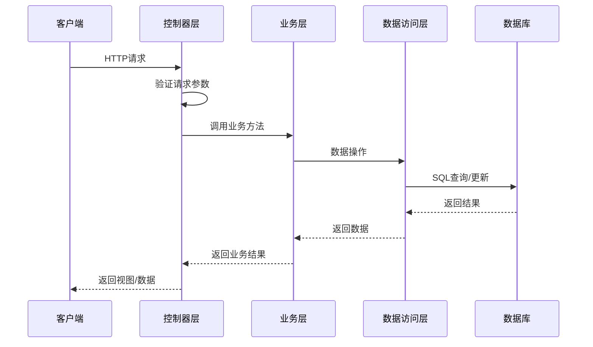
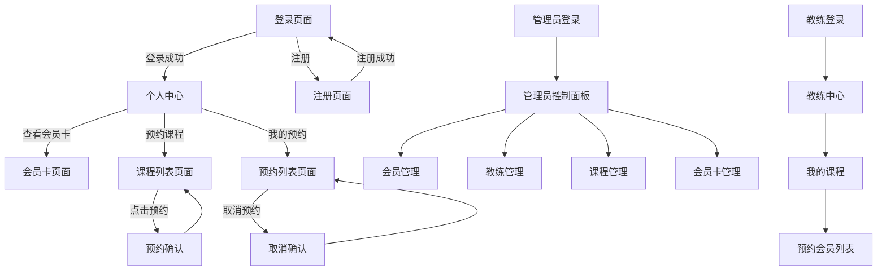

# 健身房管理系统概要设计文档

## 1. 引言

### 1.1 文档目的
本文档基于健身房管理系统的需求规格说明书，详细描述系统的整体架构设计、模块划分、接口设计、数据库设计等内容，为系统的详细设计和编码实现提供指导。

### 1.2 术语定义
- MVC：Model-View-Controller，模型-视图-控制器架构模式
- DAO：Data Access Object，数据访问对象
- DTO：Data Transfer Object，数据传输对象
- AOP：Aspect-Oriented Programming，面向切面编程
- IOC：Inversion of Control，控制反转
- DI：Dependency Injection，依赖注入

## 2. 系统架构设计

### 2.1 整体架构
- **架构风格**：采用SpringBoot的MVC架构，前后端不分离
- **分层结构**：
  - 表现层（Controller）：处理HTTP请求，返回视图或数据
  - 业务层（Service）：实现业务逻辑
  - 数据访问层（DAO/Repository）：与数据库交互
  - 实体层（Entity）：数据模型
  - 工具层（Util）：通用工具类
  - 配置层（Config）：系统配置

### 2.2 技术栈
- **后端框架**：SpringBoot 2.3.x
- **ORM框架**：MyBatis 3.5.x
- **安全框架**：Spring Security 5.x
- **数据库**：MySQL 5.7.32
- **项目管理**：Maven 3.9.11
- **前端技术**：Thymeleaf 3.x、Bootstrap 4.x、jQuery 3.x
- **构建工具**：Maven
- **开发环境**：JDK 1.8.0_152

### 2.3 核心流程图


## 3. 模块划分

### 3.1 模块结构
```
com.gym
├── config/              # 系统配置
├── controller/          # 控制器
│   ├── MemberController.java
│   ├── CoachController.java
│   └── AdminController.java
├── service/             # 业务层
│   ├── impl/            # 业务实现
│   ├── UserService.java
│   ├── CourseService.java
│   ├── BookingService.java
│   └── MembershipCardService.java
├── mapper/              # 数据访问层
│   ├── UserMapper.java
│   ├── CourseMapper.java
│   ├── BookingMapper.java
│   └── MembershipCardMapper.java
├── entity/              # 实体类
│   ├── User.java
│   ├── Course.java
│   ├── Booking.java
│   └── MembershipCard.java
├── dto/                 # 数据传输对象
│   ├── LoginDTO.java
│   ├── CourseDTO.java
│   └── BookingDTO.java
├── util/                # 工具类
│   ├── MD5Util.java
│   └── DateUtil.java
└── exception/           # 异常处理
```

### 3.2 模块职责说明

#### 3.2.1 会员模块
- **Controller**：处理会员相关的HTTP请求，如登录、注册、预约等
- **Service**：实现会员业务逻辑，包括登录验证、预约处理等
- **Mapper**：提供会员数据访问接口

#### 3.2.2 教练模块
- **Controller**：处理教练相关的HTTP请求
- **Service**：实现教练业务逻辑
- **Mapper**：提供教练数据访问接口

#### 3.2.3 管理员模块
- **Controller**：处理管理员相关的HTTP请求
- **Service**：实现管理员业务逻辑
- **Mapper**：提供管理员数据访问接口

#### 3.2.4 公共模块
- **实体类**：定义系统中所有数据模型
- **工具类**：提供通用功能，如加密、日期处理等
- **配置**：系统配置信息

## 4. 接口设计

### 4.1 RESTful API 设计

#### 4.1.1 用户相关接口
- `POST /api/auth/login` - 用户登录
- `POST /api/auth/register` - 用户注册
- `GET /api/user/profile` - 获取用户信息

#### 4.1.2 会员相关接口
- `GET /api/member/card` - 获取会员卡信息
- `GET /api/member/bookings` - 获取预约记录

#### 4.1.3 课程相关接口
- `GET /api/courses` - 获取课程列表
- `POST /api/courses/book` - 预约课程
- `DELETE /api/courses/book/{id}` - 取消预约

#### 4.1.4 管理员相关接口
- `GET /api/admin/members` - 获取会员列表
- `POST /api/admin/coaches` - 添加教练
- `DELETE /api/admin/coaches/{id}` - 删除教练
- `POST /api/admin/courses` - 添加课程
- `POST /api/admin/card-types` - 设置会员卡类型

### 4.2 控制器接口定义

#### 4.2.1 MemberController
```java
@Controller
@RequestMapping("/member")
public class MemberController {
    
    @GetMapping("/login")
    public String loginPage() { ... }
    
    @PostMapping("/login")
    public String login(@RequestParam String phone, @RequestParam String password) { ... }
    
    @GetMapping("/register")
    public String registerPage() { ... }
    
    @PostMapping("/register")
    public String register(@RequestParam String phone, @RequestParam String password) { ... }
    
    @GetMapping("/card")
    public String viewCard(Model model) { ... }
    
    @GetMapping("/courses")
    public String viewCourses(Model model) { ... }
    
    @PostMapping("/courses/book")
    public String bookCourse(@RequestParam Long courseId) { ... }
    
    @GetMapping("/bookings")
    public String viewBookings(Model model) { ... }
    
    @PostMapping("/bookings/cancel/{id}")
    public String cancelBooking(@PathVariable Long id) { ... }
}
```

#### 4.2.2 CoachController
```java
@Controller
@RequestMapping("/coach")
public class CoachController {
    
    @GetMapping("/courses")
    public String viewMyCourses(Model model) { ... }
    
    @GetMapping("/courses/{id}/members")
    public String viewCourseMembers(@PathVariable Long id, Model model) { ... }
}
```

#### 4.2.3 AdminController
```java
@Controller
@RequestMapping("/admin")
public class AdminController {
    
    @GetMapping("/members")
    public String manageMembers(@RequestParam(required = false) String keyword, Model model) { ... }
    
    @PostMapping("/members/disable/{id}")
    public String disableMember(@PathVariable Long id) { ... }
    
    @GetMapping("/coaches")
    public String manageCoaches(Model model) { ... }
    
    @PostMapping("/coaches/add")
    public String addCoach(@RequestParam String name, @RequestParam String phone) { ... }
    
    @PostMapping("/coaches/delete/{id}")
    public String deleteCoach(@PathVariable Long id) { ... }
    
    @GetMapping("/courses")
    public String manageCourses(Model model) { ... }
    
    @PostMapping("/courses/add")
    public String addCourse(@ModelAttribute CourseDTO courseDTO) { ... }
    
    @GetMapping("/card-types")
    public String manageCardTypes(Model model) { ... }
    
    @PostMapping("/card-types/add")
    public String addCardType(@RequestParam String type, @RequestParam Double price) { ... }
}
```

## 5. 数据库设计

### 5.1 数据库表结构

#### 5.1.1 用户表（user）
| 字段名 | 数据类型 | 约束 | 描述 |
| :--- | :--- | :--- | :--- |
| `id` | `BIGINT` | `PRIMARY KEY, AUTO_INCREMENT` | 用户ID |
| `phone` | `VARCHAR(20)` | `UNIQUE, NOT NULL` | 手机号 |
| `password` | `VARCHAR(100)` | `NOT NULL` | 密码（MD5加密） |
| `type` | `VARCHAR(10)` | `NOT NULL` | 用户类型（MEMBER/COACH/ADMIN） |
| `name` | `VARCHAR(50)` | `NOT NULL` | 姓名 |
| `status` | `INT` | `DEFAULT 1` | 状态（1-启用，0-禁用） |
| `create_time` | `DATETIME` | `DEFAULT CURRENT_TIMESTAMP` | 创建时间 |

#### 5.1.2 会员卡表（membership_card）
| 字段名 | 数据类型 | 约束 | 描述 |
| :--- | :--- | :--- | :--- |
| `id` | `BIGINT` | `PRIMARY KEY, AUTO_INCREMENT` | 会员卡ID |
| `user_id` | `BIGINT` | `FOREIGN KEY REFERENCES user(id)` | 关联用户ID |
| `card_type` | `VARCHAR(20)` | `NOT NULL` | 卡类型（月卡/季卡/年卡） |
| `price` | `DECIMAL(10,2)` | `NOT NULL` | 价格 |
| `start_date` | `DATE` | `NOT NULL` | 开始日期 |
| `end_date` | `DATE` | `NOT NULL` | 结束日期 |
| `status` | `INT` | `DEFAULT 1` | 状态（1-有效，0-过期） |

#### 5.1.3 课程表（course）
| 字段名 | 数据类型 | 约束 | 描述 |
| :--- | :--- | :--- | :--- |
| `id` | `BIGINT` | `PRIMARY KEY, AUTO_INCREMENT` | 课程ID |
| `name` | `VARCHAR(100)` | `NOT NULL` | 课程名称 |
| `coach_id` | `BIGINT` | `FOREIGN KEY REFERENCES user(id)` | 关联教练ID |
| `course_time` | `DATETIME` | `NOT NULL` | 课程时间 |
| `max_count` | `INT` | `NOT NULL` | 人数上限 |
| `current_count` | `INT` | `DEFAULT 0` | 当前预约人数 |
| `status` | `VARCHAR(20)` | `DEFAULT 'NOT_STARTED'` | 状态（未开始/进行中/已结束） |

#### 5.1.4 预约表（booking）
| 字段名 | 数据类型 | 约束 | 描述 |
| :--- | :--- | :--- | :--- |
| `id` | `BIGINT` | `PRIMARY KEY, AUTO_INCREMENT` | 预约ID |
| `user_id` | `BIGINT` | `FOREIGN KEY REFERENCES user(id)` | 会员ID |
| `course_id` | `BIGINT` | `FOREIGN KEY REFERENCES course(id)` | 课程ID |
| `booking_time` | `DATETIME` | `DEFAULT CURRENT_TIMESTAMP` | 预约时间 |
| `status` | `VARCHAR(20)` | `DEFAULT 'BOOKED'` | 状态（已预约/已取消） |

### 5.2 数据传输对象（DTO）

#### 5.2.1 LoginDTO.java
```java
public class LoginDTO {
    private String phone;
    private String password;
    // getter and setter
}
```

#### 5.2.2 CourseDTO.java
```java
public class CourseDTO {
    private String name;
    private Long coachId;
    private Date courseTime;
    private Integer maxCount;
    // getter and setter
}
```

#### 5.2.3 BookingDTO.java
```java
public class BookingDTO {
    private Long userId;
    private Long courseId;
    // getter and setter
}
```

## 6. 安全设计

### 6.1 认证与授权
- 使用Spring Security实现用户认证
- 基于角色的访问控制（RBAC）
- 密码使用MD5加密存储

### 6.2 安全配置
```java
@Configuration
@EnableWebSecurity
public class SecurityConfig extends WebSecurityConfigurerAdapter {
    
    @Override
    protected void configure(HttpSecurity http) throws Exception {
        http
            .authorizeRequests()
                .antMatchers("/", "/login", "/register", "/css/**", "/js/**").permitAll()
                .antMatchers("/member/**").hasRole("MEMBER")
                .antMatchers("/coach/**").hasRole("COACH")
                .antMatchers("/admin/**").hasRole("ADMIN")
                .anyRequest().authenticated()
            .and()
            .formLogin()
                .loginPage("/login")
                .defaultSuccessUrl("/index")
                .permitAll()
            .and()
            .logout()
                .permitAll();
    }
    
    @Bean
    public PasswordEncoder passwordEncoder() {
        return new BCryptPasswordEncoder();
    }
}
```

## 7. 界面设计

### 7.1 页面结构
- 登录/注册页面
- 会员中心页面
- 课程列表页面
- 教练管理页面
- 管理员控制面板

### 7.2 页面流转


## 8. 非功能需求实现

### 8.1 性能优化
- 数据库索引优化
- 连接池配置
- 缓存机制（可选）

### 8.2 错误处理
- 全局异常处理
- 友好的错误提示

### 8.3 日志记录
- 使用SLF4J + Logback记录系统日志
- 关键操作记录审计日志

## 9. 部署方案

### 9.1 环境要求
- JDK 1.8.0_152
- Maven 3.9.11
- MySQL 5.7.32
- Tomcat 9.x（可选，SpringBoot内嵌）

### 9.2 打包部署
- 使用Maven打包为jar文件
- 执行`java -jar gym-management.jar`启动服务

## 10. 总结

本概要设计文档基于健身房管理系统的需求规格说明书，详细描述了系统的架构设计、模块划分、接口设计、数据库设计等内容。系统采用SpringBoot框架，前后端不分离架构，使用MySQL作为数据库，实现了会员、教练和管理员三个主要角色的功能需求。

通过本设计，系统将实现用户认证与授权、课程预约管理、会员卡管理等核心功能，为健身房提供一套完整的管理解决方案。